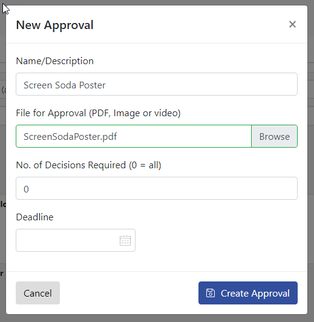
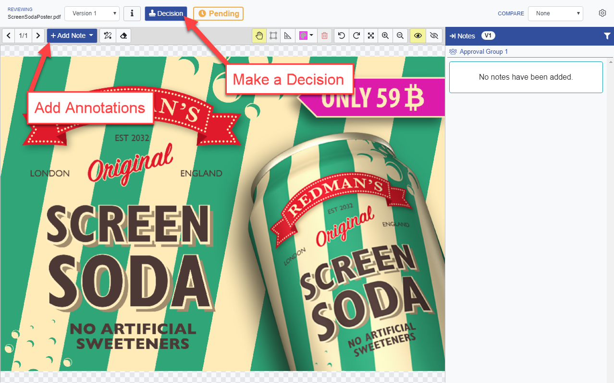

# Basic Approval Workflow

## Approval Process \(Basic Introduction\)

To start the process upload a PDF image or video from the approvals list page by clicking the **New Approval** button**...**

 **** ...enter a description, choose a file and click **Create Approval**.

When the file is uploaded & processed, View the annotation tool by clicking **Review** and discover the tools to draw & annotate directly on he uploaded file.

As an admin user, you will automatically be added to an approval group, we will look at added users a bit later.

