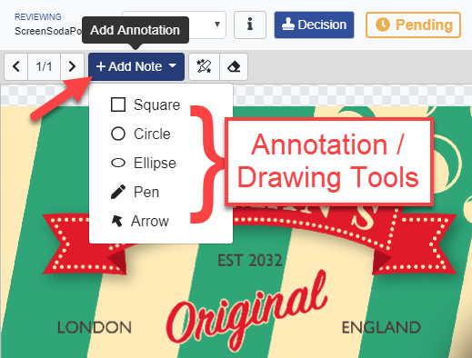
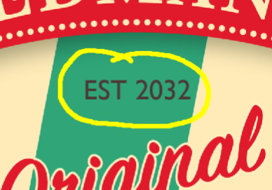
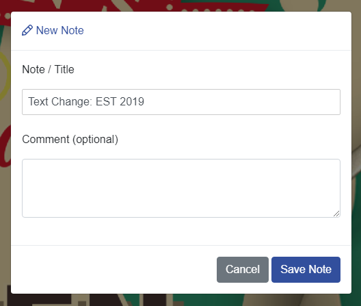
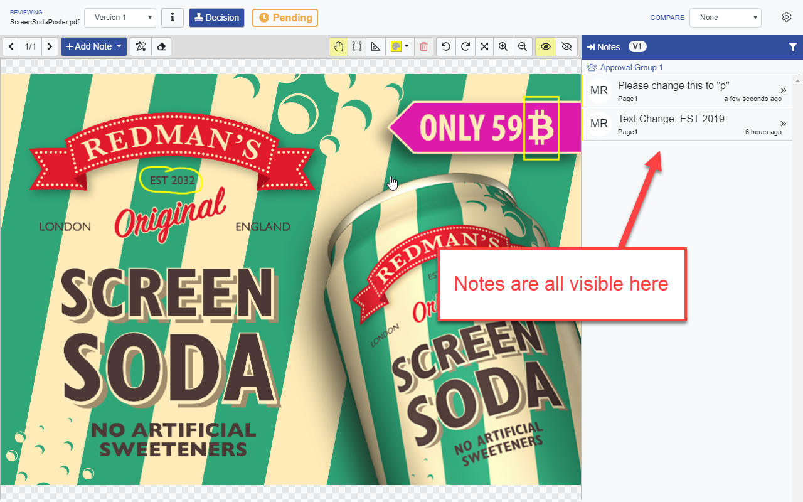
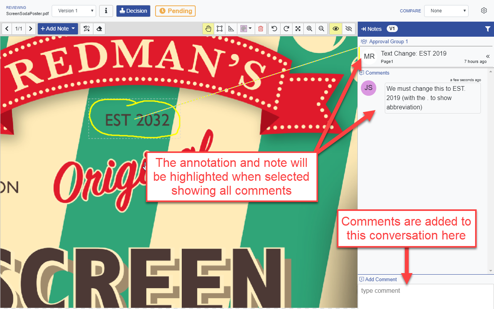

# Notes & Comments

## Making Notes: Annotation & Markup

Notes/Annotations are added by selecting an annotation/drawing tool. Various tools are provided to  highlight area depending on the nature of the feedback.

In this example we use the Pen tool to markup an area of interest.

When the annotation has been made, you will be asked to enter a Note this is the primary note linked to the annotation.

All notes are visible on the right hand side of the page.

Clicking on the annotation or note will display the note and it's related comments, this keeps all comments as a conversation in a single thread. Additional comments are added as required.

