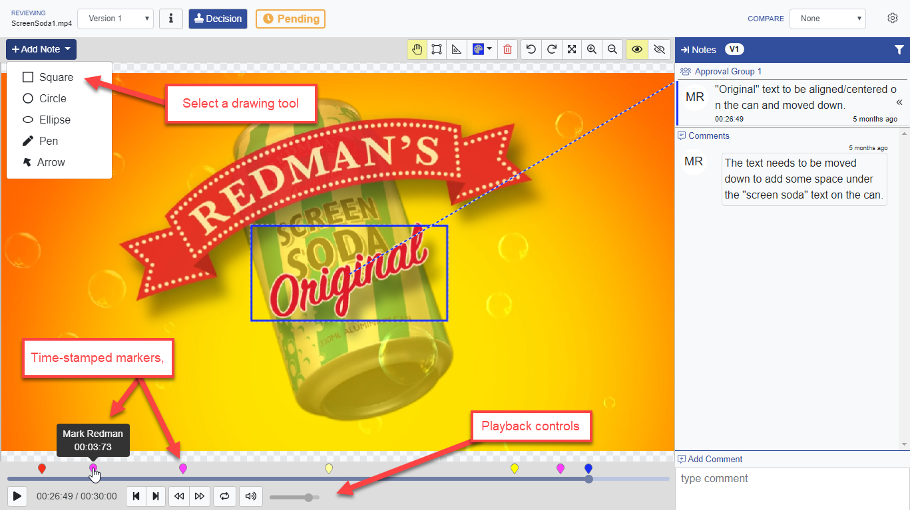

# Video Markup

## Review & Annotation of Video Content

Uploading, reviewing approving content is the consistent across all media types. 

Notes/Annotations are added by using same drawing tools as PDF or images,   
The only difference with video is the play-back tools instead of page selection.

